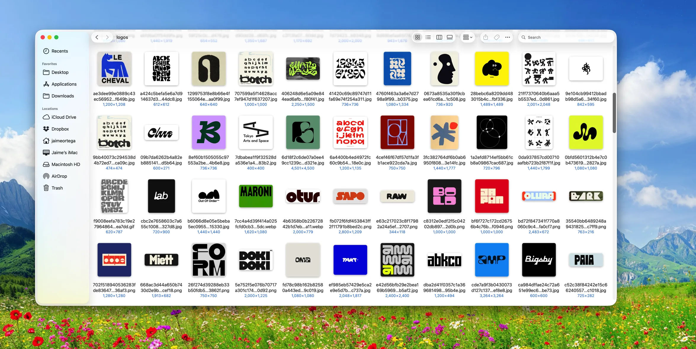
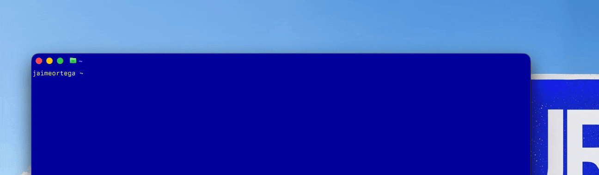

<p align="center">
  
</p>

<br>

I hate downloading Pinterest images by hand. So I built pinrip.

Use a nice CLI command to download images from a page (pin, board, search,
profile) as full-resolution originals.



```
pinrip <pinterest-url>              # rip up to 50 images
pinrip use <folder>                 # sticky: all rips land there until "use off"
pinrip use                          # show the sticky folder
pinrip use off                      # back to folders named after the page
pinrip <url> --out <folder>         # one-off destination for this rip
pinrip <url> --limit 80             # different cap
pinrip <url> --allow-dupes          # re-download images already in the folder
pinrip <url> --headed               # watch the browser work
pinrip --login                      # one-time: log in so feeds load fully
```

Images land in `~/Downloads/pinterest-rip/<folder>/`, named by pin hash —
where `<folder>` is `--out`, else the sticky folder, else a slug of the page
title. Plain names live under `pinterest-rip/`; anything with a `/` is used
as a path. Images already in the destination folder are skipped, so ripping
into the same folder twice only adds what's new — while the same image can
still appear in different folders (each folder is its own set).



## How it works

Headless Chromium (Playwright) opens the page, auto-scrolls collecting
`i.pinimg.com` image URLs (Pinterest virtualizes the DOM, so this must happen
while scrolling), stops at the cap or when the feed stalls, then downloads
each image — upgrading sized thumbnails (`236x/`, `736x/`, …) to
`/originals/` with extension fallbacks.

Logged out, Pinterest stops feeding related pins after ~25–30 images.
Run `pinrip --login` once (a window opens; log in; close it) — the session
persists in `~/.pinrip/profile` and rips then reach the full cap.

## Install

```
git clone https://github.com/JaimeOrtegaxyz/pinrip.git
cd pinrip
npm install
npx playwright install chromium
npm link        # puts `pinrip` on your PATH
```

## License

MIT — see [LICENSE](LICENSE).

<br>


